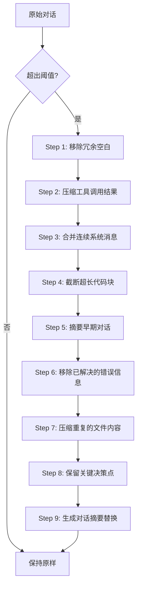

# 上下文压缩

当对话变长时，openAIDE会自动压缩上下文，在保留关键信息的同时控制 Token 消耗。

## 为什么需要压缩

LLM 有上下文窗口限制（如 Claude 200K、GPT-4o 128K）。长对话会导致：
- 超出上下文窗口
- Token 成本增加
- 响应速度变慢

## 9 步压缩流程

openAIDE采用渐进式压缩策略：



### 各步骤详解

| 步骤 | 操作 | 压缩率 |
|------|------|--------|
| 1 | 移除多余空白和格式 | ~5% |
| 2 | 将工具结果替换为摘要 | ~20% |
| 3 | 合并连续的系统消息 | ~5% |
| 4 | 截断超过 200 行的代码块 | ~15% |
| 5 | 将早期对话替换为摘要 | ~30% |
| 6 | 移除已解决的错误堆栈 | ~10% |
| 7 | 去重重复引用的文件内容 | ~15% |
| 8 | 标记并保留关键决策 | 0% |
| 9 | 生成整体摘要替换 | ~40% |

## 触发条件

压缩在以下情况自动触发：
- 对话 Token 数超过上下文窗口的 70%
- 单次请求的 Token 数超过模型限制

也可以手动触发：
- 命令：`OpenAIDE: Compact Context`

## 配置

```json
{
  // 压缩触发阈值（上下文窗口的百分比）
  "openaide.context.compactThreshold": 0.7,

  // 压缩后保留的最近消息数
  "openaide.context.keepRecentMessages": 10,

  // 是否保留所有工具调用结果
  "openaide.context.keepToolResults": false,

  // 摘要使用的模型（建议用快速模型）
  "openaide.context.summaryModel": "deepseek-chat"
}
```

## 压缩质量

openAIDE的压缩策略经过精心设计，确保：
- ✅ 保留用户的关键指令和偏好
- ✅ 保留最近的对话上下文
- ✅ 保留重要的代码修改记录
- ✅ 保留未解决的错误信息
- ❌ 移除冗余的文件内容重复
- ❌ 移除已完成的中间步骤
