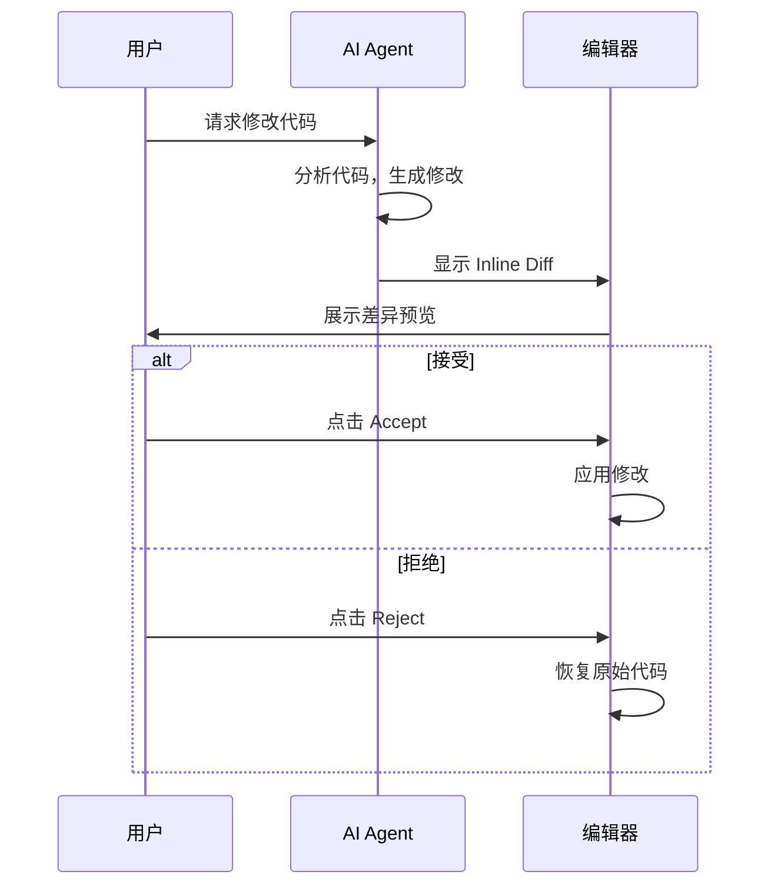

# Inline Diff

Inline Diff 是openAIDE的代码编辑预览功能，AI 修改代码前会先展示差异，让你决定是否接受。

## 工作流程



## 触发方式

### 通过 Chat

在 Chat 中请求 AI 修改代码，AI 调用 `file-edit` 工具时会自动显示 Diff：

```
你：把 src/utils.ts 中的 forEach 改成 for...of 循环
AI：[调用 file-edit] → 显示 Inline Diff
```

### 通过 Inline Edit

1. 选中代码区域
2. 按 `Cmd/Ctrl+I` 打开 Inline Edit
3. 输入修改指令
4. AI 生成修改并显示 Diff

## Diff 视图

### 单文件 Diff

在编辑器中直接显示：
- 🟢 **绿色** — 新增的代码
- 🔴 **红色** — 删除的代码
- 操作按钮：`✅ Accept` / `❌ Reject`

### 多文件 Diff

当 AI 修改多个文件时，会在侧边栏显示文件列表：
- 点击文件名查看该文件的 Diff
- 可以逐文件接受/拒绝
- 也可以一键全部接受/拒绝

## 快捷键

| 快捷键 | 功能 |
|--------|------|
| `Cmd/Ctrl+I` | 触发 Inline Edit |
| `Cmd/Ctrl+Enter` | 接受当前 Diff |
| `Cmd/Ctrl+Backspace` | 拒绝当前 Diff |
| `Alt+]` | 跳转到下一个 Diff |
| `Alt+[` | 跳转到上一个 Diff |

## 配置

```json
{
  // Diff 显示模式：inline（行内）或 side-by-side（并排）
  "openaide.diff.mode": "inline",

  // 自动接受低风险修改（如格式化）
  "openaide.diff.autoAcceptFormatting": false,

  // Diff 高亮颜色
  "openaide.diff.addedColor": "#22c55e20",
  "openaide.diff.removedColor": "#ef444420"
}
```
