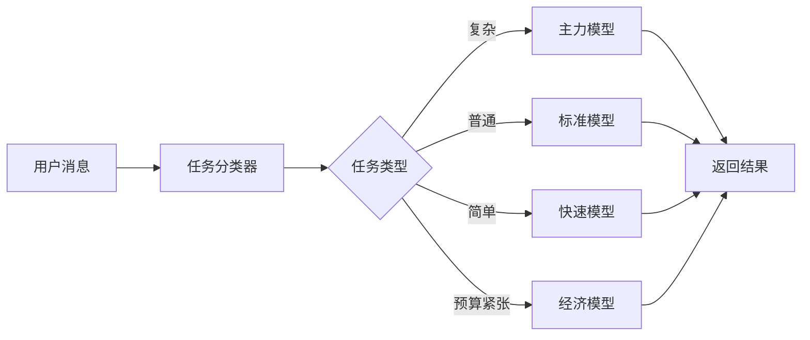

# 模型路由

openAIDE内置智能模型路由器，根据任务类型自动选择最优模型，平衡质量和成本。

## 工作原理



## 任务分类

路由器支持 12 种任务类型：

| 任务类型 | 模型层级 | 示例消息 |
|----------|---------|---------|
| `code-generation` | 主力 | "帮我写一个 OAuth 认证模块" |
| `code-review` | 主力 | "审查这段代码的安全性" |
| `refactoring` | 主力 | "重构这个类，使用策略模式" |
| `debugging` | 主力 | "这个函数有 bug，帮我找出来" |
| `explanation` | 标准 | "解释这段代码的作用" |
| `documentation` | 标准 | "为这个函数写文档" |
| `testing` | 标准 | "为这个模块写单元测试" |
| `simple-edit` | 快速 | "把变量名改成驼峰命名" |
| `formatting` | 经济 | "格式化这段代码" |
| `translation` | 快速 | "把注释翻译成英文" |
| `chat` | 快速 | "TypeScript 的泛型怎么用？" |
| `unknown` | 标准 | 无法分类的任务 |

## 配置路由

```json
{
  "router": {
    "models": {
      "primary": "claude-sonnet-4-20250514",
      "standard": "gpt-4o",
      "fast": "deepseek-chat",
      "economy": "glm-4-flash"
    },
    "budget": {
      "dailyLimitUSD": 5,
      "monthlyLimitUSD": 100
    },
    "fallback": {
      "enabled": true,
      "order": ["primary", "standard", "fast", "economy"]
    }
  }
}
```

## 预算控制

路由器内置预算控制：

- **每日预算** — 超出后自动降级到更便宜的模型
- **月度预算** — 超出后停止使用付费模型
- **自动降级** — 预算紧张时自动选择更经济的模型

### 预算状态

在状态栏查看当前预算使用情况：

```
💰 $2.35 / $5.00 (今日)
```

## 手动覆盖

在 Chat 中可以手动指定模型：

```
/model claude-sonnet-4-20250514
帮我重构这个复杂的类

/model deepseek-chat
把这段注释翻译成英文
```

## Fallback 机制

当首选模型不可用时（API 错误、限流等），路由器会自动切换到备选模型：

```
primary → standard → fast → economy
```
