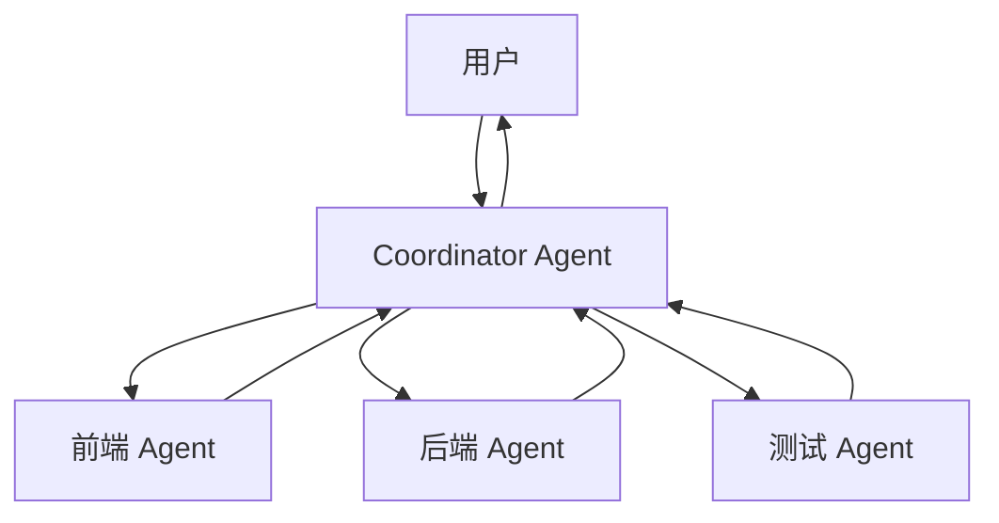
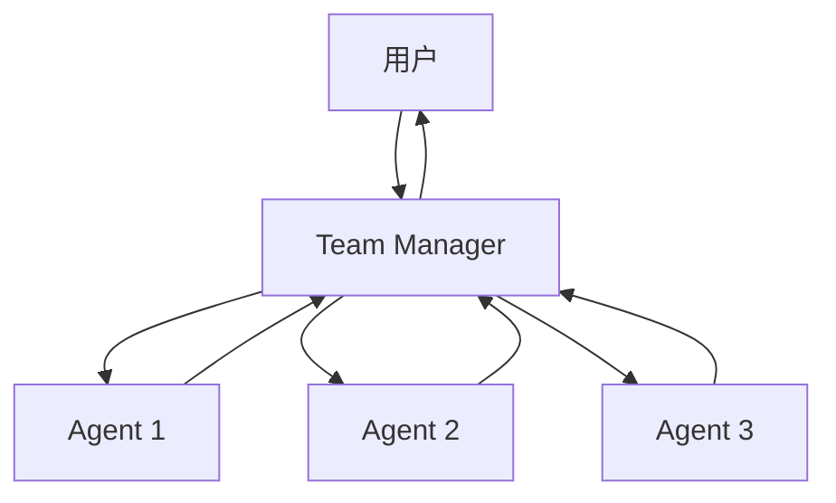

# Multi-Agent 协作

openAIDE支持多个 AI Agent 协同工作，处理复杂的跨文件、跨领域任务。

## 两种模式

### Coordinator 模式

一个主 Agent（协调者）分析任务，将子任务分配给专门的子 Agent：



适用场景：
- 全栈开发任务（前端 + 后端 + 数据库）
- 需要多步骤协调的复杂任务
- 代码审查 + 修复 + 测试

### Team 模式

多个平级 Agent 各自独立工作，最后汇总结果：



适用场景：
- 并行处理多个独立文件
- 批量重构
- 多语言翻译

## 使用方式

### 通过 Chat 命令

```
/coordinator 重构整个认证模块，包括前端登录页面、后端 API 和单元测试

/team 为 src/utils/ 下的所有文件添加 JSDoc 注释
```

### 通过命令面板

- `OpenAIDE: Start Coordinator Mode`
- `OpenAIDE: Start Team Mode`

## 子 Agent 配置

每个子 Agent 可以有独立的配置：

```json
{
  "agents": {
    "frontend": {
      "model": "claude-sonnet-4-20250514",
      "tools": ["file-read", "file-write", "file-edit", "glob", "grep"],
      "systemPrompt": "你是前端开发专家，精通 React 和 TypeScript"
    },
    "backend": {
      "model": "claude-sonnet-4-20250514",
      "tools": ["file-read", "file-write", "file-edit", "bash", "glob", "grep"],
      "systemPrompt": "你是后端开发专家，精通 Node.js 和数据库"
    },
    "tester": {
      "model": "deepseek-chat",
      "tools": ["file-read", "file-write", "bash", "glob"],
      "systemPrompt": "你是测试工程师，擅长编写单元测试和集成测试"
    }
  }
}
```

## 注意事项

- Multi-Agent 模式会消耗更多 Token，注意预算控制
- 子 Agent 之间不共享对话历史
- Coordinator 模式的协调者会汇总所有子 Agent 的结果
- 建议复杂任务使用 Coordinator，批量任务使用 Team
