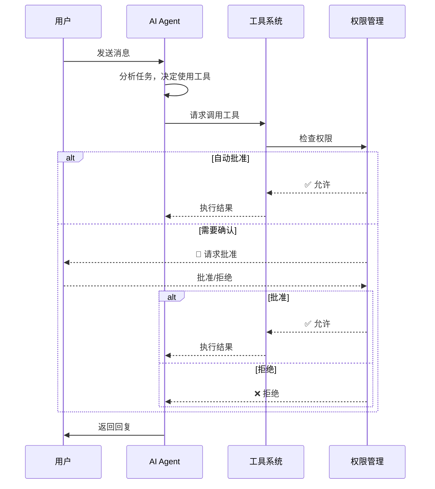

# 工具概览

openAIDE内置 9 个核心工具，AI Agent 可以通过这些工具与开发环境交互。

## 工具列表

| 工具 | 名称 | 功能 | 权限级别 |
|------|------|------|---------|
| 📖 [FileRead](/tools/file-read) | `file-read` | 读取文件内容 | 低 |
| ✏️ [FileWrite](/tools/file-write) | `file-write` | 创建/覆写文件 | 中 |
| 🔧 [FileEdit](/tools/file-edit) | `file-edit` | 编辑文件（搜索替换） | 中 |
| 🔍 [Glob](/tools/glob) | `glob` | 文件模式匹配搜索 | 低 |
| 🔎 [Grep](/tools/grep) | `grep` | 文本内容搜索 | 低 |
| 💻 [Bash](/tools/bash) | `bash` | 执行 Shell 命令 | 高 |
| 🌐 [WebFetch](/tools/web-fetch) | `web-fetch` | 抓取网页内容 | 低 |
| 🔍 [WebSearch](/tools/web-search) | `web-search` | 搜索引擎查询 | 低 |
| 🤖 [Agent](/tools/agent) | `agent` | 创建子 Agent | 中 |

## 权限模型

openAIDE采用三级权限模型控制工具的使用：

### 权限级别

- **低风险**（自动批准）：只读操作，如文件读取、搜索
- **中风险**（需确认）：文件修改操作，首次需要用户确认
- **高风险**（每次确认）：命令执行等危险操作，每次都需要确认

### 权限范围

```
Session（会话级）
  └── Project（项目级）
       └── Global（全局级）
```

- **会话级**：仅在当前对话中有效
- **项目级**：在当前项目中持久有效
- **全局级**：跨项目持久有效

### 配置权限规则

```typescript
// 允许在当前项目中自动执行 npm 命令
permissionManager.addRule({
  tool: 'bash',
  pattern: 'npm *',
  decision: 'allow',
  scope: 'project',
});

// 全局禁止 rm -rf 命令
permissionManager.addRule({
  tool: 'bash',
  pattern: 'rm -rf *',
  decision: 'deny',
  scope: 'global',
});
```

## 工具调用流程



## 自定义工具

你可以通过 MCP 协议添加自定义工具：

```json
// .openaide/mcp.json
{
  "servers": {
    "my-tools": {
      "command": "node",
      "args": ["./my-mcp-server.js"],
      "env": {}
    }
  }
}
```

详见 [MCP 协议指南](/guide/mcp)。

## 下一步

点击各工具名称查看详细文档和使用示例。
